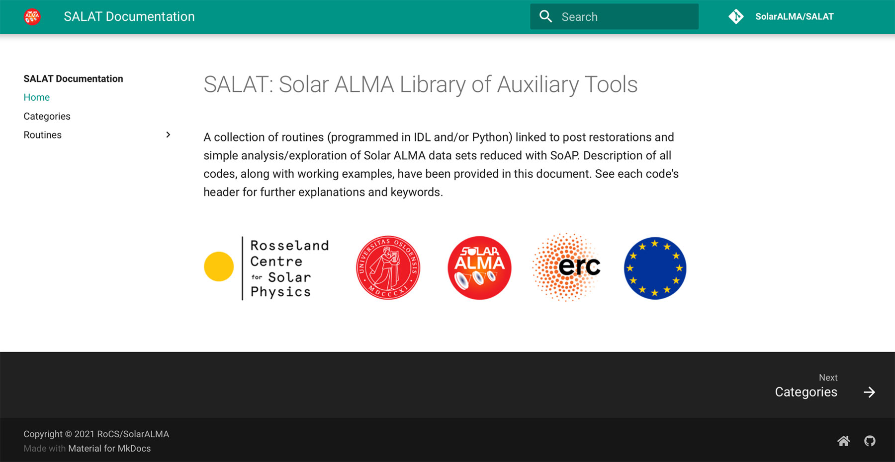

## SALAT: Solar ALMA Library of Auxiliary Tools</strong>

     
    
    

A collection of routines (programmed in IDL and/or Python) linked to post restorations and simple analysis/exploration of Solar ALMA data sets reduced with SoAP. Description of all codes, along with working examples, have been provided in this document. See each code's header for further explanations and keywords.

## Documentation

See the documentation at **[https://solaralma.github.io/SALAT](https://solaralma.github.io/SALAT/)** for **getting started guides**, **descriptions**, and **working examples**.
