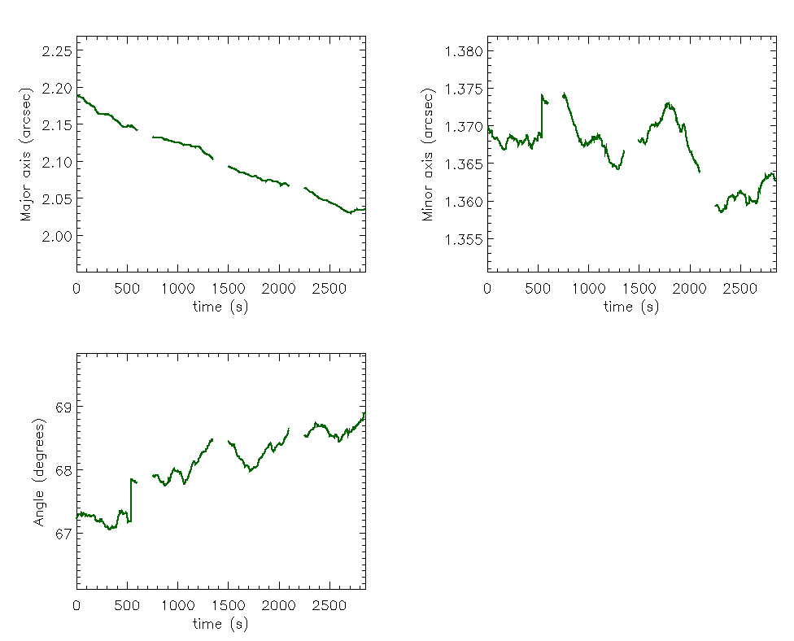

# :low_brightness: SALAT_BEAM_STATS

!!! example "SALAT_BEAM_STATS"
	Print statistics aboout synthesised beam and plot variation of the beam parameters with time.
	
	**CALLING SEQUENCE:**
	```webidl
	IDL> salat_beam_stats, cube
	```
	=== "INPUTS / OPTIONAL KEYWORDS"
		Option | Description | Status
		------ | ----------- | -------
		**`CUBE`** | The SALSA cube in FITS format | `required`
	
	=== "OUTPUTS"
		Parameter | Description
		------ | -----------
		**`N/A`** | The plotted statistics.
		
	=== "EXAMPLE"
		```webidl
		IDL> cube = './solaralma.b3.fba.20161222_141931-150707.2016.1.00423.S.level4.k.fits'
		IDL> salat_beam_stats, cube
		 ----------------------------------------------
		 |  Beam Statistics:
		 ----------------------------------------------
		 |  -- Major axis (arcsec):
		 |  Min = 2.03014
		 |  Max = 2.18938
		 |  Median = 2.10207
		 |
		 |  -- Minor axis (arcsec):
		 |  Min = 1.35839
		 |  Max = 1.37406
		 |  Median = 1.36777
		 |
		 |  -- Angle (degrees):
		 |  Min = 67.0412
		 |  Max = 68.9073
		 |  Median = 68.1305
		 ----------------------------------------------
		```
	
		

	!!! quote "[Source code](https://github.com/SolarAlma/SALAT/blob/main/IDL/salat_beam_stats.pro)"

!!! Success "Back to the list of [IDL Routines](../idl.md)"