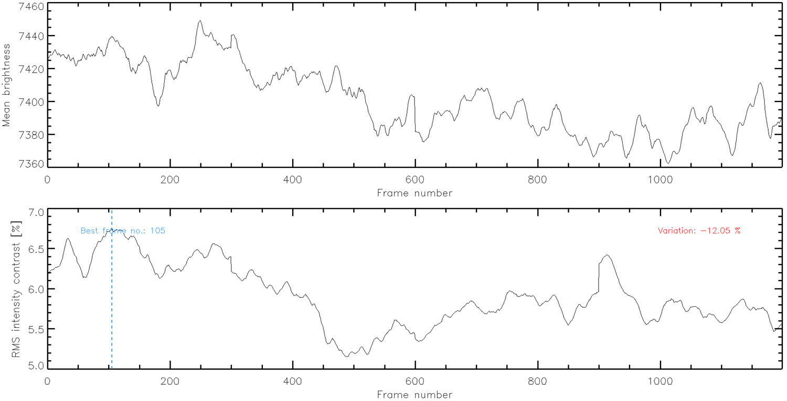

# :low_brightness: SALAT_CONTRAST

!!! example "SALAT_CONTRAST"
	Compute and plot "mean intensity" and "rms intensity contrast" of a cube and indicate bad/good frames based on a given threshold.
	
	**CALLING SEQUENCE:**
	```webidl
	IDL> bestframe = salat_contrast(cube, limit=limit, badframes=badframes, goodframes=goodframes)
	```
	=== "INPUTS / OPTIONAL KEYWORDS"
		Option | Description | Status
		------ | ----------- | -------
		**`CUBE`** | The ALMA data cube in `[x,y,t]` format | `required`
		**`FITS`** | It should be set if the cube is a fits file (default = 0). | `optional`
		**`LIMIT`** | A limit for the rms intensity contrast, with which 'good' and 'bad' frames are identified. | `optional`
		**`SIDE`** | Number of pixels to be excluded from sides of the field of view prior to calculations of the mean intensity and rms contrast (default = 0).  | `optional`
		**`SHOW_BEST`** | If set, location of the best frame (i.e., that with the largest rms contrast) is indicated on the plot (default = 0).  | `optional`
		**`TITLE`** | It should be set if the cube is a fits file. | `optional`
	
	=== "OUTPUTS"
		Parameter | Description
		------ | -----------
		**`BESTFRAME`** | Index of the best frame (i.e., that with the largest rms contrast).
		**`GOODFRAMES`** | Indices of 'good' frames, i.e., those above the LIMIT, only if the LIMIT is defined (`optional`)
		**`BADFRAMES`** | Indices of 'bad' frames, i.e., those below the LIMIT, only if the LIMIT is defined (`optional`)
		
	=== "EXAMPLE"
		To get the band information:
		```webidl
		IDL> dir = '/mn/stornext/d13/alma/shahin/almaobs_level4/b3__2016-12-22/'
		IDL> cube = dir+'solaralma.b3.2016-12-22.14:19:31-15:07:07__2016.1.00423.S_clean_inK_sj_level4.fits'
		IDL> bestframe = salat_contrast(cube, /fits, side=100, /show_best)
		
			 Variation of mean brightness (imean): -0.79 %
			 Variation of rms intensity contrast (rmsCont): -12.05 %
			 
		IDL> print, bestframe
			 105.000
		```
		
		
	
	!!! quote "[Source code](https://github.com/SolarAlma/SALAT/blob/main/IDL/salat_contrast.pro)"

!!! Success "Back to the list of [IDL Routines](../idl.md)"