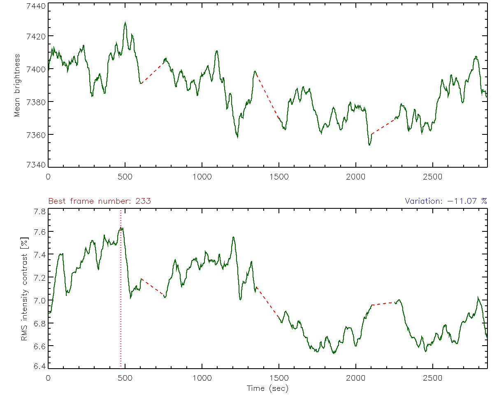

# :low_brightness: SALAT_CONTRAST

!!! example "SALAT_CONTRAST"
	Compute and plot "mean intensity" and "rms intensity contrast" of a cube and indicate bad/good frames based on a given threshold. Gaps (due to ALMA calibration routines) are marked with Red dashed lines.
	
	**CALLING SEQUENCE:**
	```webidl
	IDL> bestframe = salat_contrast(cube, limit=limit, badframes=badframes, goodframes=goodframes)
	```
	=== "INPUTS / OPTIONAL KEYWORDS"
		Option | Description | Status
		------ | ----------- | -------
		**`CUBE`** | The ALMA FITS cube in [x,y,t] format. | `required`
		**`SHOW_BEST`** | If set, location of the best frame (i.e., that with the largest rms contrast) is indicated on the plot. | `optional`
		**`TITLE`** | It should be set if the cube is a fits file. | `optional`
		**`SIDE`** | Number of pixels to be excluded from sides of the field of view prior to calculations of the mean intensity and rms contrast.  | `optional`
	
	=== "OUTPUTS"
		Parameter | Description
		------ | -----------
		**`BESTFRAME`** | Index of the best frame (i.e., that with the largest rms contrast).
		**`TIME_INDEX`** | Name of a variable for the frame indices sorted from the highest to lowest rms-intensity-contrast image
		
	=== "EXAMPLE"
		Reading the data, header, time, and beam information from a SALSA data cube:
		```webidl
		IDL> cube = './solaralma.b3.fba.20161222_141931-150707.2016.1.00423.S.level4.k.fits'
		IDL> bestframe = salat_contrast(cube, /show_best, time_index=time_index)
		 -- Variation of mean brightness (imean): -0.44 %
		 -- Variation of rms intensity contrast (rmsCont): -11.07 %
		IDL> im = readfits(cube)
		IDL> best_ten_frames_cube = im[*,*,time_index[0:9]]
		```

		
	
	!!! quote "[Source code](https://github.com/SolarAlma/SALAT/blob/main/IDL/salat_contrast.pro)"

!!! Success "Back to the list of [IDL Routines](../idl.md)"