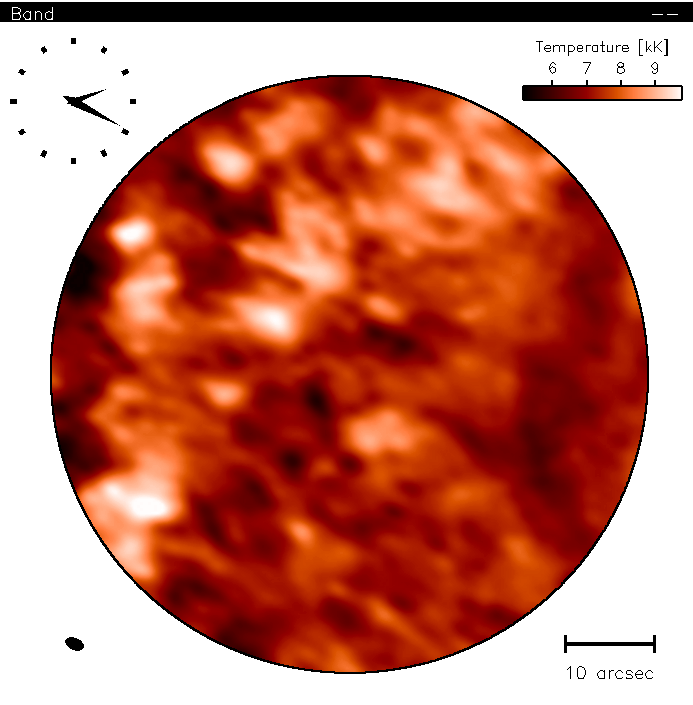

# :low_brightness: SALAT_PLOT_MAP

!!! example "SALAT_PLOT_MAP"
	Plot a map with optional features: color legend, synthesised beam etc. and save images as JPG or PNG files (optional).
	
	**CALLING SEQUENCE:**
	```webidl
	IDL> salat_plot_map, cube
	```
	=== "INPUTS / OPTIONAL KEYWORDS"
		Option | Description | Status
		------ | ----------- | -------
		**`CUBE`** | The SALSA cube in FITS format | `required`
		**`COLOR_LEGEND`** | If set, a colorbar is also plotted | `optional`
		**`BEAM`** | If set, the beam shape/size is also depicted | `optional`
		**`AVERAGE`** | If set, average of the entire time series is plotted | `optional`
		**`TIMESTEP`** | The index of a frame to be plotted. If set, no movie is plotted. | `optional`
		**`SAVEDIR`** | A directory's location in which images are stored. | `optional`
		**`JPG`** | If SAVEDIR is defined, type of the stored image(s) is JPG | `optional`
		**`PNG`** | If SAVEDIR is defined, type of the stored image(s) is PNG (default) | `optional`
		**`CLOCK`** | If set, a clock displaying the observing time(s) is plotted | `optional`
		
	=== "OUTPUTS"
		Parameter | Description
		------ | -----------
		**`N/A`** | The plotted image or the time series as a movie and optionally save them as JPG (or PNG)
		
	=== "EXAMPLE"
		```webidl
		IDL> cube = './solaralma.b3.fba.20161222_141931-150707.2016.1.00423.S.level4.k.fits'
		IDL> salat_plot_map, cube, /color_legend, /beam, /clock
		```
	
		

	!!! quote "[Source code](https://github.com/SolarAlma/SALAT/blob/main/IDL/salat_plot_map.pro)"

!!! Success "Back to the list of [IDL Routines](../idl.md)"