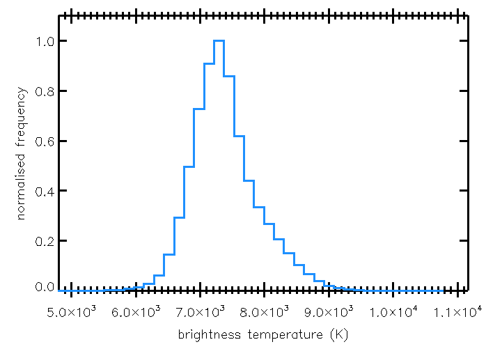

# :low_brightness: SALAT_STATS

!!! example "SALAT_STATS"
	Reads in a SALSA level4 FITS cubes and outputs basic statistics of the data cube (or a frame) as a structure and print them in terminal (optional). A histogram is also plotted (optional)
	
	**CALLING SEQUENCE:**
	```webidl
	IDL> result = salat_stats(cube, /histogram)
	```
	=== "INPUTS / OPTIONAL KEYWORDS"
		Option | Description | Status
		------ | ----------- | -------
		**`CUBE`** | The SALSA data cube in FITS format | `required`
		**`FRAME`** | The frame number for which the statistics are calculated (if not set, they are measured for the entire time series) | `optional`
		**`SILENT`** | If set, no information is printed in terminal | `optional`
		**`HISTOGRAM`** | If set, a histogram is also plotted (i.e., brightness temperature distribution of the data cube or a frame)  | `optional`
	
	=== "OUTPUTS"
		Parameter | Description
		------ | -----------
		**`STATS`** | Statistics parameters as a structure
		
	=== "EXAMPLE"
		```webidl
		IDL> cube = './solaralma.b3.fba.20161222_141931-150707.2016.1.00423.S.level4.k.fits'
		IDL> result = salat_stats(cube, /histogram)
		 ----------------------------------------------
		 |  Statistics (data unit: K):
		 ----------------------------------------------
		 |  Array size:  x = 320  y = 320  t = 1200
		 |  Number of data points = 122880000
		 |  Min = 4573.0864
		 |  Max = 10635.463
		 |  Mean = 7387.2971
		 |  Median = 7326.9473
		 |  Mode = 7299.1414
		 |  Standard deviation = 518.84095
		 |  Variance = 269195.93
		 |  Skew = 0.55234913
		 |  Kurtosis = 0.78927953
		 |  Percentile1 (value range between the 1st and 99th percentile)= 6318.5532 - 8812.2432
		 |  Percentile5 (value range between the 5th and 95th percentile)= 6645.1826 - 8361.0938
		 ----------------------------------------------
		IDL> help, result
		** Structure <29aff18>, 11 tags, length=104, data length=104, refs=1:
		   MIN             DOUBLE           4573.0864
		   MAX             DOUBLE           10635.463
		   MEAN            DOUBLE           7387.2971
		   MEDIAN          DOUBLE           7326.9473
		   ...		   ...			  ...
		```

			

	!!! quote "[Source code](https://github.com/SolarAlma/SALAT/blob/main/IDL/salat_stats.pro)"

!!! Success "Back to the list of [IDL Routines](../idl.md)"