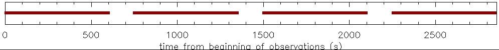

# :low_brightness: SALAT_TIMELINE

!!! example "SALAT_TIMELINE"
	Displays a timeline with missing frames and calibration gaps and outputs corresponding info (time indices)
	
	**CALLING SEQUENCE:**
	```webidl
	IDL> result = salat_timeline(cube)
	```
	=== "INPUTS / OPTIONAL KEYWORDS"
		Option | Description | Status
		------ | ----------- | -------
		**`CUBE`** | The SALSA data cube in FITS format | `required`
		**`GAP`** | Time difference in seconds that will be considered a gap (missing frames). Default: cadence*1.5 | `optional`
		**`TIME`** | Name of a variable for observing time, in seconds from UTC midnight. format: float | `optional`
		**`STIME`** | Name of a variable for observing time in UTC (optional). format: string  | `optional`
	
	=== "OUTPUTS"
		Parameter | Description
		------ | -----------
		**`RESULT`** | Time index ranges of consequent sequences in the form of (n,2), where n is the number of consequent sequences.
		
	=== "EXAMPLE"
		```webidl
		IDL> cube = './solaralma.b3.fba.20161222_141931-150707.2016.1.00423.S.level4.k.fits'
		IDL> result = salat_timeline(cube, time=time, stime=stime)
		IDL> help, time, stime
		TIME            FLOAT     = Array[1200]
		STIME           STRING    = Array[1200]
		IDL> print, time[result[0,1]], time[result[1,0]] ; time interval of first gap (if any)
		      51871.0      51874.5
		```

		
	
	!!! quote "[Source code](https://github.com/SolarAlma/SALAT/blob/main/IDL/salat_timeline.pro)"

!!! Success "Back to the list of [IDL Routines](../idl.md)"