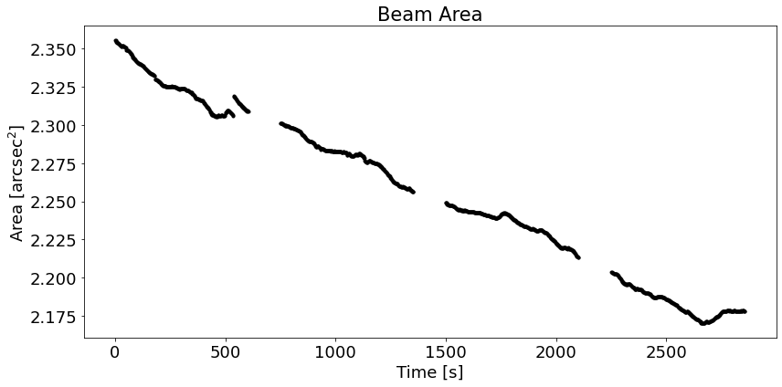

# :low_brightness: SALAT_BEAM_STATS

!!! example "SALAT_BEAM_STATS"
	Print statistics aboout synthesised beam and plot variation of the beam parameters with time.
	
	**CALLING SEQUENCE:**
	```python
	>>> import salat
	>>> salat.beam_stats(beammajor1,beamminor1,beamangle1,timesec1,plot=True)
	```
	=== "INPUTS / OPTIONAL KEYWORDS"
		Option | Description | Status | Default
		------ | ----------- | ------ | -------
		**`beammajor`** | Beam major array from "[salat_read](./salat_read.md)". | `required` | 
		**`beamminor`** | Beam minor array from "[salat_read](./salat_read.md)". | `required` | 
		**`beamangle`** | Beam angle array from "[salat_read](./salat_read.md)". | `required` | 
		**`timesec`** | Timesec array from "[salat_read](./salat_read.md)" | `required` | 
		**`plot`** | If `True`, plot beam area change on time.  | `optional` | `False`
	
	=== "OUTPUTS"
		Parameter | Description
		------ | -----------
		**`N/A`** | Information printed in terminal.
		**`fig`** | If `plot=True`.


		
	=== "EXAMPLE"
		```python
		>>> import salat
		>>> salat.beam_stats(beammajor1,beamminor1,beamangle1,timesec1,plot=True)
		```	
		```
		---------------------------------------------------
		------------ SALAT BEAM STATS part of -------------
		-- Solar Alma Library of Auxiliary Tools (SALAT) --
		Computing Statistics
		---------------------------------------------------
		----------------------------------------------
		|  Beam Statistics: 
		----------------------------------------------
		|  Min (major,minor,angle,area) =  (2.0301436772570014, 1.3583892490714788, 67.04122, 2.1699882237884673)
		|  Max (major,minor,angle,area) =  (2.1893782541155815, 1.3740585884079337, 68.90729, 2.3556596243785903)
		|  Mean (major,minor,angle,area) =  (2.101498652540613, 1.3666819556965493, 68.04936, 2.2558125338146087)
		|  Median (major,minor,angle,area) =  (2.097920689266175, 1.367768389172852, 68.129944, 2.252857507134082)
		|  Standard deviation (major,minor,angle,area) =  (0.046229713450479264, 0.004009421305141309, 0.5219541, 0.05374611320453778)
		----------------------------------------------
		```
		
	
	!!! quote "[Source code](https://github.com/SolarAlma/SALAT/blob/9bfa6c648a27ea5b6958d51d8384420ec9096642/Python/salat.py#L656)"

!!! Success "Back to the list of [Python functions](../python.md)"