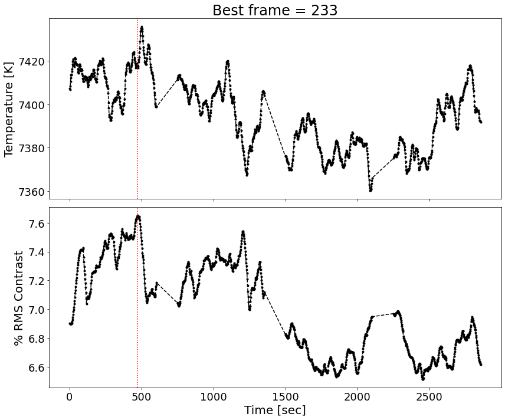

# :low_brightness: SALAT_CONTRAST

!!! example "SALAT_CONTRAST"
	Compute and plot "mean intensity" and "rms intensity contrast" of a cube and indicate bad/good frames based on a given threshold. Gaps (due to ALMA calibration routines) are marked with Red dashed lines.
	
	**CALLING SEQUENCE:**
	```python
	>>> import salat
	>>> bfrs = salat.contrast(almacube,timesec,show_best=True)
	```
	=== "INPUTS / OPTIONAL KEYWORDS"
		Option | Description | Status | Default
		------ | ----------- | ------ | -------
		**`almadata`** | Datacube as array from "[salat_read](./salat_read.md)". It can be 2D and 3D | `required` | 
		**`timesec`** | Timesec array from "[salat_read](./salat_read.md)" | `required` | 
		**`side`** | Number of pixels to be excluded from sides of the field of view prior to calculations of the mean intensity and rms contrast. | `required` | `5`
		**`show_best`** | If `True`, location of the best frame (i.e., that with the largest rms contrast) is indicated on the plot. | `optional` | `False`
	
	=== "OUTPUTS"
		Parameter | Description
		------ | -----------
		**`bestframes`** | Indexes of the best frames sorted (i.e., that with the largest rms contrast).
		**`fig`** | A matplotlib plot is produced.

		
	=== "EXAMPLE"
		Finding best frames and plotting RMS contrast for one cube
		```python
		>>> import salat
		>>> bfrs = salat.contrast(almacube,timesec,show_best=True)
		```	
		```
		---------------------------------------------------
		------------ SALAT CONTRAST part of -------------
		-- Solar Alma Library of Auxiliary Tools (SALAT) --
		```
		
	
	!!! quote "[Source code](https://github.com/SolarAlma/SALAT/blob/9bfa6c648a27ea5b6958d51d8384420ec9096642/Python/salat.py#L760)"

!!! Success "Back to the list of [Python functions](../python.md)"