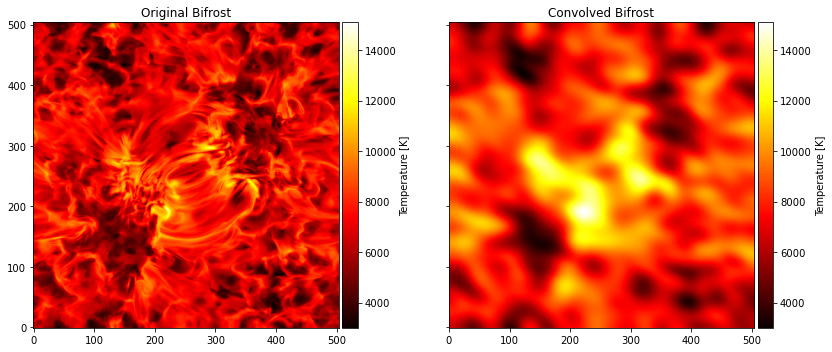

# :low_brightness: SALAT_CONVOLVE_BEAM

!!! example "SALAT_CONVOLVE_BEAM"
	Convolve a specified synthetic beam (from an ALMA observations) to a user-provided map (e.g. from a simulation or observations with other instruments).
	
	**CALLING SEQUENCE:**
	```python
	>>> import salat
	>>> convolve_image = salat.convolve_beam(data,[beammajor1,beamminor1,beamangle1],pxsize=pxsize)
	```
	=== "INPUTS / OPTIONAL KEYWORDS"
		Option | Description | Status | Default
		------ | ----------- | ------ | -------
		**`data`** | A frame in array format to be convolved with the ALMA beam. | `required` | 
		**`beam`** | A list containing the beam parameters as [bmaj,bmin,bang] "[salat_read](./salat_read.md)". | `required` | 
		**`pxsize`** | Pixel size in arcsec of the data to be convolved  | `required` |
	
	=== "OUTPUTS"
		Parameter | Description
		------ | -----------
		**`data_convolved`** | The convolved image as array

		
	=== "EXAMPLE"
		For this example a bifrost snapshot is used as input. Also, original and convolved images are plotted for comparision
		```python
		>>> import salat
		>>> import astropy.units as u
		>>> import numpy as np
		>>> import matplotlib.pyplot as plt
		>>> import matplotlib
		>>> from mpl_toolkits.axes_grid1 import make_axes_locatable
		>>> filebifrost = path_folder + "bifrost_b3_frame400.fits"
		>>> bifrostdata = fits.open(filebifrost)[0].data
		>>> pxsizebifrost = 0.06 #This is assumed
		>>> bifrostconv = salat.convolve_beam(bifrostdata,[beammajor1,beamminor1,beamangle1],pxsize=pxsizebifrost)
		```	
		```
		------------------------------------------------------
		------------ SALAT CONVOLVE BEAM part of -------------
		---- Solar Alma Library of Auxiliary Tools (SALAT)----
		For the input data, NANs are not properly handle
		Please use fill_nans parameter when loading fits
		------------------------------------------------------
		```
		```
		#PLotting
		fig,ax = plt.subplots(ncols=2,figsize=(12,5),sharex=True,sharey=True)
		imorg = ax[0].imshow(bifrostdata,origin='lower',cmap='hot')
		divider = make_axes_locatable(ax[0])
		cax = divider.append_axes('right', size='5%', pad=0.05)
		cb = fig.colorbar(imorg, cax=cax, orientation='vertical',label=r'Temperature [K]')
		imcon = ax[1].imshow(bifrostconv,origin='lower',cmap='hot')
		divider = make_axes_locatable(ax[1])
		cax = divider.append_axes('right', size='5%', pad=0.05)
		cb = fig.colorbar(imorg, cax=cax, orientation='vertical',label=r'Temperature [K]')
		ax[0].set_title(r'Original Bifrost')
		ax[1].set_title(r'Convolved Bifrost')
		plt.tight_layout()		
		```
		
	
	!!! quote "[Source code](https://github.com/SolarAlma/SALAT/blob/9bfa6c648a27ea5b6958d51d8384420ec9096642/Python/salat.py#L827)"

!!! Success "Back to the list of [Python functions](../python.md)"