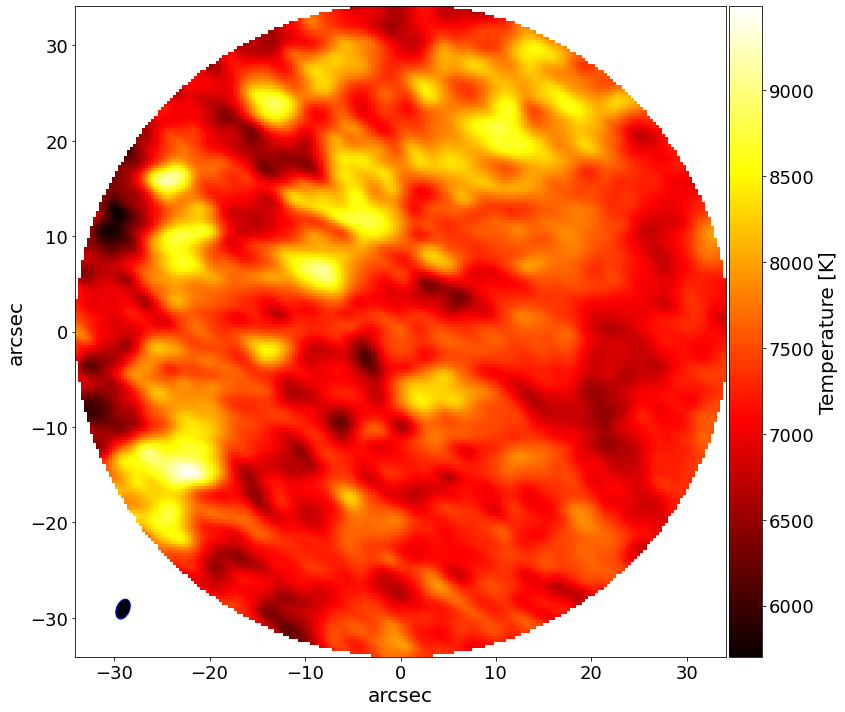

# :low_brightness: SALAT_PLOT_MAP

!!! example "SALAT_PLOT_MAP"
	This function makes map plot centered at (0,0) arcsec, save images as JPG or PNG files (optional).
	
	**CALLING SEQUENCE:**
	```python
	>>> import salat
	>>> salat.plot_map(almadata,beam,pxsize,cmap='hot',average=False,timestp=0,savepng=False,savejpg=False,outputpath="./")
	```
	=== "INPUTS / OPTIONAL KEYWORDS"
		Option | Description | Status | Default
		------ | ----------- | ------ | -------
		**`almadata`** | Datacube as array from "[salat_read](./salat_read.md)". It can be 2D and 3D | `required` | 
		**`beam`** | List with beam info as `[bmaj,bmin,bang]` from "[salat_read](./salat_read.md)" | `required` |
		**`pxsize`** | Pixelsize in arcsec from "[salat_header](./salat_read_header.md)" | `required` |
		**`cmap`** | String of colormap name | `optional` | `hot`
		**`average`** | If `True`, it plots the average image of a 3D cube | `optional` | `False`
		**`timestp`** | Integer, index of frame for plotting | `optional` | `0`
		**`savepng`** | If `True`, it saves image in path as PNG | `optional` | `False`
		**`savejpg`** | If `True`, it saves image in path as JPG | `optional` | `False`
		**`outputpath`** | Directory path to save image  | `optional` | `./`
	
	=== "OUTPUTS"
		Parameter | Description
		------ | -----------
		**`fig`** | Matplotlib plot of map is produced. 

		
	=== "EXAMPLE"
		```python
		>>> import salat
		#Plot map timestp=100 using colormap='jet' ans saving as jpg
		>>> salat.plot_map(almadata,beam,pxsize,cmap='jet',average=False,timestp=100,savepng=False,savejpg=True,outputpath="./")
		```	
		```
		---------------------------------------------------
		------------ SALAT PLOT MAP part of ---------------
		-- Solar Alma Library of Auxiliary Tools (SALAT) --
		```
		
	
	!!! quote "[Source code](https://github.com/SolarAlma/SALAT/blob/9bfa6c648a27ea5b6958d51d8384420ec9096642/Python/salat.py#L546)"

!!! Success "Back to the list of [Python functions](../python.md)"


