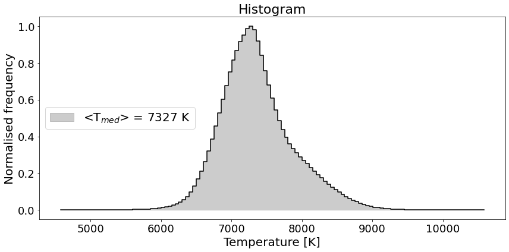

# :low_brightness: SALAT_STATS

!!! example "SALAT_STATS"
	Reads in a SALSA level4 FITS cubes and outputs basic statistics of the data cube (or a frame) as a dictionary and print them in terminal (optional). A histogram is also plotted (optional)
	
	**CALLING SEQUENCE:**
	```python
	>>> import salat
	>>> datastats = salat.stats(almadata,Histogram=True,)
	```
	=== "INPUTS / OPTIONAL KEYWORDS"
		Option | Description | Status | Default
		------ | ----------- | ------ | -------
		**`almadata`** | Datacube as array from "[salat_read](./salat_read.md)". It can be 2D and 3D | `required` | 
		**`Histogram`** | If `True`, it plots a temperature distribution histogram | `optional` | `False` 
		**`SILENT`** | If `True`, no information is printed to the terminal.  | `optional` | `False`
	
	=== "OUTPUTS"
		Parameter | Description
		------ | -----------
		**`datastats`** | Python dictionary with computed stats.
		**`fig`** | A matplotlib histogram of temperature distribution is produced if `Histogram=True`.


		
	=== "EXAMPLE"
		```python
		>>> import salat
		>>> datastats = salat.stats(almadata,Histogram=True,)
		```	
		```
		---------------------------------------------------
		--------------- SALAT STATS part of ----------------
		-- Solar Alma Library of Auxiliary Tools (SALAT) --
		Computing Statistics
		----------------------------------------------
		----------------------------------------------
		|  Statistics: 
		----------------------------------------------
		|  Array size: t = 1200 x = 213  y = 213
		|  Min =  4573.08642578125
		|  Max =  10635.462890625
		|  Mean =  7387.675114081175
		|  Median =  7327.32373046875
		|  Mode =  7305.5439453125
		|  Standard deviation =  518.919333625818
		|  Variance =  269277.274810663
		|  Skew =  0.5515735886224322
		|  Kurtosis =  0.7880637528361976
		|  Percentile 1 =  [6318.5185498  8812.49609375]
		|  Percentile 5 =  [6645.40478516 8361.46972656]
		----------------------------------------------

		```
		
	
	!!! quote "[Source code](https://github.com/SolarAlma/SALAT/blob/9bfa6c648a27ea5b6958d51d8384420ec9096642/Python/salat.py#L270)"

!!! Success "Back to the list of [Python functions](../python.md)"