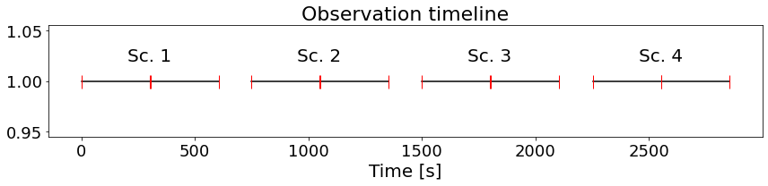

# :low_brightness: SALAT_TIMELINE

!!! example "SALAT_TIMELINE"
	Displays a timeline with missing frames and calibration gaps and outputs corresponding info (time indices)
	
	**CALLING SEQUENCE:**
	```python
		>>> import salat
		>>> scans_idxs,mfram_idxs = salat.timeline(timesec,gap=30)
	```
	=== "INPUTS / OPTIONAL KEYWORDS"
		Option | Description | Status | Default
		------ | ----------- | ------ | -------
		**`timesec`** | Timesec array from "[salat_read](./salat_read.md)" | `required` | 
		**`gap`** | Time gap to considered two frames correspond to different scans | `required` | `30 
	
	=== "OUTPUTS"
		Parameter | Description
		------ | -----------
		**`scans_idx`** | Python dictionary with indexes for all scans in observation.
		**`mfram_idx`** | Python dictionary with indixes of all consequent sequences.
		**`fig`** | A matplotlib plot showing the timeline is produced.

		
	=== "EXAMPLE"
		Finding best frames and plotting RMS contrast for one cube
		```python
		>>> import salat
		>>> scans_idxs,mfram_idxs = salat.timeline(timesec,gap=30)
		>>> print("Indexes scans: ", idxscans)
		>>> print("Indexes consequent frames: ",idxcqfrs)
		```	
		```
		---------------------------------------------------
		------------- SALAT TIME LINE part of -------------
		-- Solar Alma Library of Auxiliary Tools (SALAT) --
		Indexes scans:  {'Sc. 1': [0, 299], 'Sc. 2': [300, 599], 'Sc. 3': [600, 899], 'Sc. 4': [900, 1199]}
		Indexes consequent frames:  {'Sec. 1': [0, 149], 'Sec. 2': [150, 299], 'Sec. 3': [300, 449], 'Sec. 4': [450, 599], 'Sec. 5': [600, 749], 'Sec. 6': [750, 899], 'Sec. 7': [900, 1049], 'Sec. 8': [1050, 1199]}
		```
		
	
	!!! quote "[Source code](https://github.com/SolarAlma/SALAT/blob/9bfa6c648a27ea5b6958d51d8384420ec9096642/Python/salat.py#L395)"

!!! Success "Back to the list of [Python functions](../python.md)"